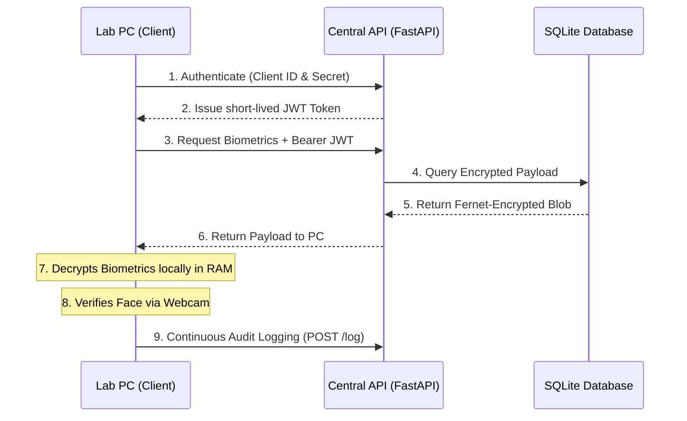

# 🛡️ Face-Verified Access Lock System


A high-assurance, **continuous multi-factor authentication (MFA)** system designed to secure computer laboratory environments against insider threats, impersonation, and physical session hijacking.

This project implements a **Centralized Client-Server Architecture** operating on a **Zero-Trust** model. It utilizes biometric continuous verification, Time-Based One-Time Passwords (TOTP), and strict fail-closed security policies to guarantee the physical identity of a user at a terminal.

---

## 📑 Table of Contents
1. [Project Overview](#1-project-overview)
2. [Core Features](#2-core-features)
3. [System Architecture](#3-system-architecture)
4. [Threat Model & Security Scoping](#4-threat-model--security-scoping)
5. [Directory Structure](#5-directory-structure)
6. [Setup & Installation](#6-setup--installation)

---

## 1. Project Overview
In shared laboratory environments (e.g., University Computer Labs), traditional password-based authentication is fundamentally flawed. Students frequently share credentials or walk away from unlocked workstations, leaving the terminal vulnerable to unauthorized access or malicious actions (*Session Hijacking by Proximity*).

**The Solution:** This system replaces local, implicit trust with a strict, continuous, multi-factor pipeline. Users must authenticate with three independent factors to start a session. Once authenticated, a continuous background daemon ensures the original user remains physically present at the terminal. If the user steps away, the system immediately forces an OS-level lockdown.

---

## 2. Core Features
* 🔐 **3-Factor Authentication:** Roll Number (ID), TOTP Google Authenticator Code (Have), and Live Facial Biometrics (Are).
* 👁️ **Continuous Verification:** A background daemon silently verifies the user's face every 30 seconds.
* 🤖 **Liveness Detection (Anti-Spoofing):** Requires a randomized blink challenge (Eye Aspect Ratio calculation) to defeat photographs or tablet screens.
* 🛡️ **Zero-Trust API:** All lab PCs act as untrusted edge clients communicating with a centralized FastAPI server via OAuth2 JWT tokens.
* 🔒 **End-to-End Encryption:** Biometric data is encrypted using AES (Fernet) *before* it leaves the client PC. The server stores only encrypted blobs.
* 🚨 **Fail-Closed Lockdown:** If the network goes down, or an unrecognized face appears, the system immediately locks the Windows/OS workstation.

---

## 3. System Architecture

The project is split into a **Centralized Server** and multiple **Edge Clients (Lab PCs)**.



---

## 4. Threat Model & Security Scoping

A rigorous cybersecurity system explicitly defines its scope and limitations.

### 🔴 Defended Attacks (In-Scope)
* **Credential Sharing / Impersonation:** Defeated by continuous biometric facial recognition.
* **Physical Session Hijacking:** Defeated by the continuous verification daemon. If a user walks away, the camera detects a missing face and locks the terminal within the defined grace period.
* **Basic Presentation Attacks (2D Spoofing):** Defeated by the Liveness Detection module requiring human blinks.
* **Database Compromise (Data-at-Rest):** Defeated by End-to-End Encryption. Attackers gaining access to the server's `.db` file will only see AES ciphertexts.

### 🟡 Documented Limitations (Out-of-Scope)
* **Sophisticated 3D Mask Spoofing:** The current liveness check cannot reliably defeat high-fidelity 3D masks. Hardware-level IR/Depth cameras would be required for enterprise deployment.
* **Network-Level Eavesdropping (Data-in-Transit):** For local testing, the API operates over plain HTTP. A true production deployment **MUST** wrap the FastAPI server in a reverse proxy (like Nginx) terminating TLS/HTTPS.
* **Physical Hardware Tampering:** If a malicious user unplugs the webcam, the system assumes a hardware failure and will eventually lock the screen (fail-closed). However, physical tampering of the host OS kernel is out of scope.

---

## 5. Directory Structure
```text
├── server/
│   ├── main.py              # FastAPI Central Server & JWT OAuth2 Logic
│   └── database.py          # Centralized SQLite Database engine
├── src/
│   ├── api_client.py        # Edge client handler for JWTs and E2EE encryption
│   └── crypto_utils.py      # AES Fernet encryption utilities
├── register.py              # CLI tool to enroll new students and generate TOTP QR codes
├── login.py                 # Core authentication entry point (3-Factor Auth)
├── verify.py                # Continuous background verification daemon
├── liveness_check.py        # Anti-spoofing blink challenge calculator
├── tray_app.py              # System Tray UI for manual lock and policy pauses
├── log_viewer.py            # Utility to read the centralized audit logs
└── test_checklist.md        # Comprehensive security bug-sweep test cases
```

---

## 6. Setup & Installation

### Prerequisites
* Python 3.11+
* A working webcam

### 1. Install Dependencies
```bash
# Create a virtual environment
python -m venv .venv
source .venv/Scripts/activate  # (Windows)

# Install required packages
pip install -r requirements.txt
pip install fastapi uvicorn requests pyotp qrcode PyJWT
```

### 2. Download the Facial Landmark Model
You must download the pre-trained `shape_predictor_68_face_landmarks.dat` file for Liveness Detection:
1. Download from: [http://dlib.net/files/shape_predictor_68_face_landmarks.dat.bz2](http://dlib.net/files/shape_predictor_68_face_landmarks.dat.bz2)
2. Extract the `.bz2` file.
3. Place `shape_predictor_68_face_landmarks.dat` in the root directory of this project.

### 3. Run the System
**Terminal 1 (Start the Central Server):**
```bash
python -m uvicorn server.main:app --host 127.0.0.1 --port 8000
```
**Terminal 2 (Register a User):**
```bash
python register.py
# Scan the generated QR code with Google Authenticator
```
**Terminal 3 (Login to Lab PC):**
```bash
python login.py
# Enter Roll Number, TOTP Code, and pass the blink challenge!
```

---
*Built as a Cybersecurity Final Year Project focusing on Identity & Access Management (IAM).*