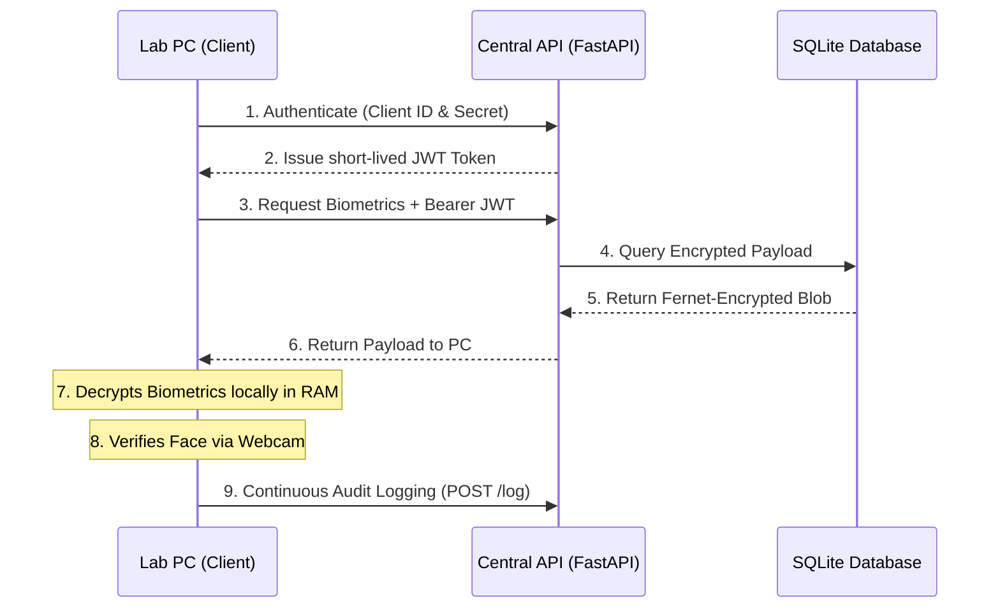

# 🛡️ Face-Verified Access Lock System


A high-assurance, **continuous multi-factor authentication (MFA)** system designed to secure computer laboratory environments against insider threats, impersonation, and physical session hijacking.

This project implements a **Centralized Client-Server Architecture** operating on a **Zero-Trust** model. It utilizes biometric continuous verification, Time-Based One-Time Passwords (TOTP), and strict fail-closed security policies to guarantee the physical identity of a user at a terminal.

---

## 📑 Table of Contents
1. [Project Overview](#1-project-overview)
2. [Core Features](#2-core-features)
3. [System Architecture](#3-system-architecture)
4. [Threat Model & Security Scoping](#4-threat-model--security-scoping)
5. [Directory Structure](#5-directory-structure)
6. [Setup & Installation](#6-setup--installation)

---

## 1. Project Overview
In shared laboratory environments (e.g., University Computer Labs), traditional password-based authentication is fundamentally flawed. Students frequently share credentials or walk away from unlocked workstations, leaving the terminal vulnerable to unauthorized access or malicious actions (*Session Hijacking by Proximity*).

**The Solution:** This system replaces local, implicit trust with a strict, continuous, multi-factor pipeline. Users must authenticate with three independent factors to start a session. Once authenticated, a continuous background daemon ensures the original user remains physically present at the terminal. If the user steps away, the system immediately forces an OS-level lockdown.

---

## 2. Core Security Concepts & Features
* 🔐 **Multi-Factor Authentication (MFA):** Requires Roll Number (Identity Claim), TOTP RFC 6238 Authenticator Code (Possession), and Live Facial Biometrics (Inherence).
* 👁️ **Continuous Authentication:** Background daemon continuously re-verifies the user's face every 30 seconds to prevent session hijacking.
* 🤖 **Randomized Challenge-Response Liveness:** Anti-spoofing engine dynamically demands random actions (blink, head turn left/right, mouth open) within a tight 4-second window, defeating photo and video replay attacks.
* 📊 **Confidence-Based Risk Assessment:** Computes 128-dimensional Euclidean embedding similarity into numerical confidence scores with three distinct risk bands (High, Medium/Borderline, Reject).
* ⛓️ **Tamper-Evident Audit Logging:** Cryptographic SHA-256 hash chaining anchored to a Genesis Hash; any alteration or deletion of log entries is mathematically detectable via `--verify-integrity`.
* 🛡️ **Per-Device Token-Based API Authentication:** Zero-Trust API architecture where each lab PC is provisioned with unique credentials and authenticates via short-lived OAuth2 JWTs.
* 🔒 **Encryption at Rest with OS-Level Key Protection:** Biometric encodings and TOTP seeds are Fernet-encrypted at rest with keys secured in the host OS Keyring (Windows Credential Manager / macOS Keychain / Linux Secret Service).
* 🌐 **Transport Security (TLS / HTTPS):** Enforces HTTPS encryption for all client-server communications, eliminating plaintext eavesdropping.
* 🚪 **Anti-Tailgating / Single-Face Policy:** Enforces a strict single-face limit in the camera frame, immediately locking the terminal if multiple faces (shoulder surfers/piggybackers) are detected.
* 🚨 **Fail-Closed Lockdown:** System always defaults to a secure locked state upon verification failure, network outage, or hardware disconnection.
* 🔔 **Real-Time Incident Alerting:** Dispatches immediate webhook alerts (e.g. Discord) for HIGH-severity events (impersonation, tampering, or spoofing).
* ⚙️ **Auditable Policy Override:** Allows administrators to temporarily pause monitoring with strict auto-expiring timeouts.

---

## 3. System Architecture

The project is split into a **Centralized Server** and multiple **Edge Clients (Lab PCs)**.


```mermaid
sequenceDiagram
    participant PC as Lab PC (Client)
    participant API as Central API (FastAPI)
    participant DB as SQLite Database
    
    PC->>API: 1. Authenticate (Client ID & Secret)
    API-->>PC: 2. Issue short-lived JWT Token
    PC->>API: 3. Request Biometrics + Bearer JWT
    API->>DB: 4. Query Encrypted Payload
    DB-->>API: 5. Return Fernet-Encrypted Blob
    API-->>PC: 6. Return Payload to PC
    Note over PC: 7. Decrypts Biometrics locally in RAM
    Note over PC: 8. Verifies Face via Webcam
    PC->>API: 9. Continuous Audit Logging (POST /log)
```

---

## 4. Threat Model & Security Scoping

A rigorous cybersecurity system explicitly defines its scope and limitations.

### 🔴 Defended Attacks (In-Scope)
* **Credential Sharing / Impersonation:** Defeated by continuous biometric facial recognition.
* **Physical Session Hijacking:** Defeated by the continuous verification daemon. If a user walks away, the camera detects a missing face and locks the terminal within the defined grace period.
* **Photo & Video Replay Attacks:** Defeated by the randomized multi-step Liveness Detection engine (blink, mouth open, head turn left/right).
* **Shoulder Surfing / Piggybacking:** Defeated by strict single-face limit enforcing instant lockout when multiple faces enter the camera frame.
* **Database Compromise (Data-at-Rest):** Defeated by Fernet symmetric encryption with keys protected in the host OS Keyring.
* **Post-Incident Log Tampering:** Defeated by SHA-256 hash-chained audit logging anchored to a Genesis Hash.
* **Network Eavesdropping / MiTM:** Defeated by enforced HTTPS/TLS transport security.

### 🟡 Documented Limitations (Out-of-Scope)
* **Sophisticated 3D Mask Spoofing:** Hardware-level IR/Depth cameras would be required for enterprise anti-mask defense.
* **CA-Signed TLS Certificates:** Self-signed certificates are used for testing; production deployments require a trusted Certificate Authority.
* **Full Local Database Rewrite:** Hash chaining makes tampering detectable, but not impossible if an attacker rewrites the entire chain from scratch on a compromised host (production requires an append-only remote ledger).

---

## 5. Directory Structure
```text
├── server/
│   ├── main.py              # FastAPI Central Server & JWT OAuth2 Logic
│   └── database.py          # Centralized SQLite Database & Hash Chaining
├── src/
│   ├── api_client.py        # Edge client handler for JWTs and E2EE encryption
│   └── crypto_utils.py      # AES Fernet encryption utilities
├── config.py                # Centralized configuration loader (TRD §6)
├── lock.py                  # Cross-platform OS workstation lock (TRD §2)
├── register.py              # CLI tool to enroll new students and generate TOTP QR codes
├── login.py                 # Core authentication entry point (3-Factor Auth)
├── verify.py                # Continuous background verification daemon
├── liveness_check.py        # Anti-spoofing randomized challenge-response calculator
├── tray_app.py              # System Tray UI for manual lock and policy pauses
├── log_viewer.py            # Utility to read and cryptographically audit logs
├── test_integration.py      # End-to-end defense-in-depth integration test suite
└── test_checklist.md        # Comprehensive security bug-sweep test cases
```

---

## 6. Setup & Installation

### Prerequisites
* Python 3.11+
* A working webcam

### 1. Install Dependencies
```bash
# Create a virtual environment
python -m venv .venv
source .venv/Scripts/activate  # (Windows)

# Install required packages
pip install -r requirements.txt
pip install fastapi uvicorn requests pyotp qrcode PyJWT
```

### 2. Download the Facial Landmark Model
You must download the pre-trained `shape_predictor_68_face_landmarks.dat` file for Liveness Detection:
1. Download from: [http://dlib.net/files/shape_predictor_68_face_landmarks.dat.bz2](http://dlib.net/files/shape_predictor_68_face_landmarks.dat.bz2)
2. Extract the `.bz2` file.
3. Place `shape_predictor_68_face_landmarks.dat` in the root directory of this project.

### 3. Run the System
**Terminal 1 (Start the Central Server):**
```bash
python -m uvicorn server.main:app --host 127.0.0.1 --port 8000
```
**Terminal 2 (Register a User):**
```bash
python register.py
# Scan the generated QR code with Google Authenticator
```
**Terminal 3 (Login to Lab PC):**
```bash
python login.py
# Enter Roll Number, TOTP Code, and pass the blink challenge!
```

---
*Built as a Cybersecurity Final Year Project focusing on Identity & Access Management (IAM).*
<!-- Welcome back! Active development resumed for Phase 3. -->
